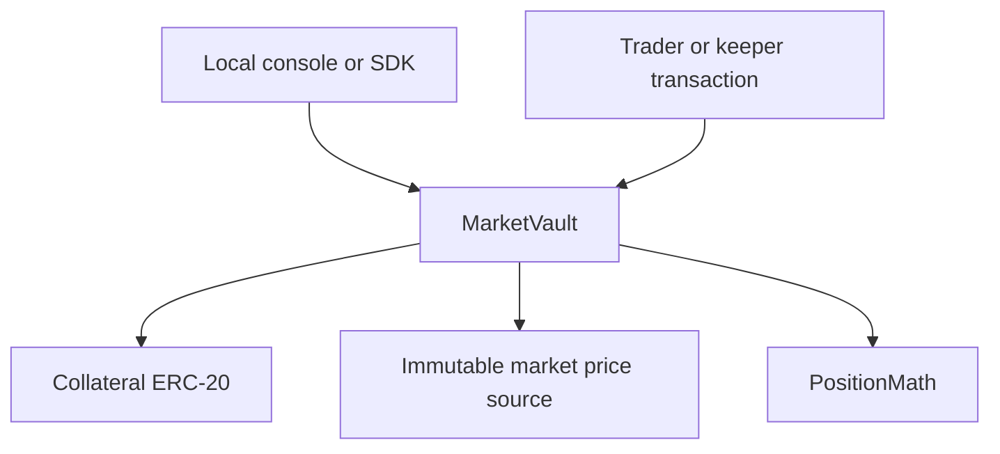

# Architecture

The protocol is a source-only local EVM application with no application server or database. The static console reads through viem and requests injected-wallet transactions. The SDK simulates transactions before wallet submission and verifies successful receipts. Chain/account changes invalidate console state.

Vault shares, positions, escrow, reservations and claims are canonical contract state. `totalAssets` is realized LP book assets, not TVL combining trader collateral and claims. A second market uses a separately deployed vault/source; balances and risk do not flow between them. No upgrade proxy, adapter that executes trades, token issuer, indexer or telemetry is included.

The hosted website's existing DEMO engine continues separately and must not be interpreted as a client of this local protocol. Read source-analysis.md for the available original source and the reason for keeping the website in its existing repository. Future integration must replace individual action fidelity only after verifying genuine deployment, oracle, collateral and failure behavior; it must not silently turn every demo route into an onchain interface.
